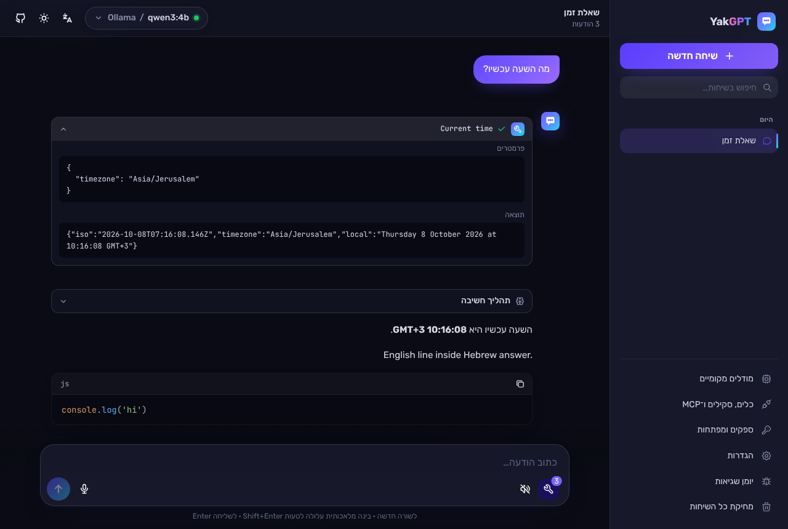
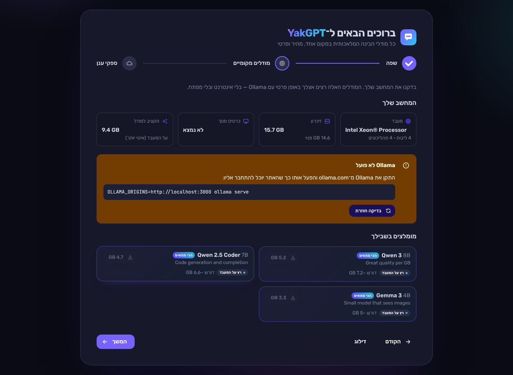
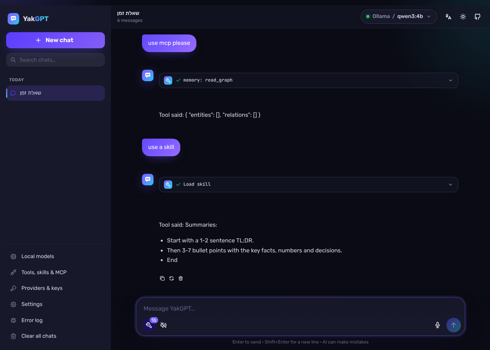
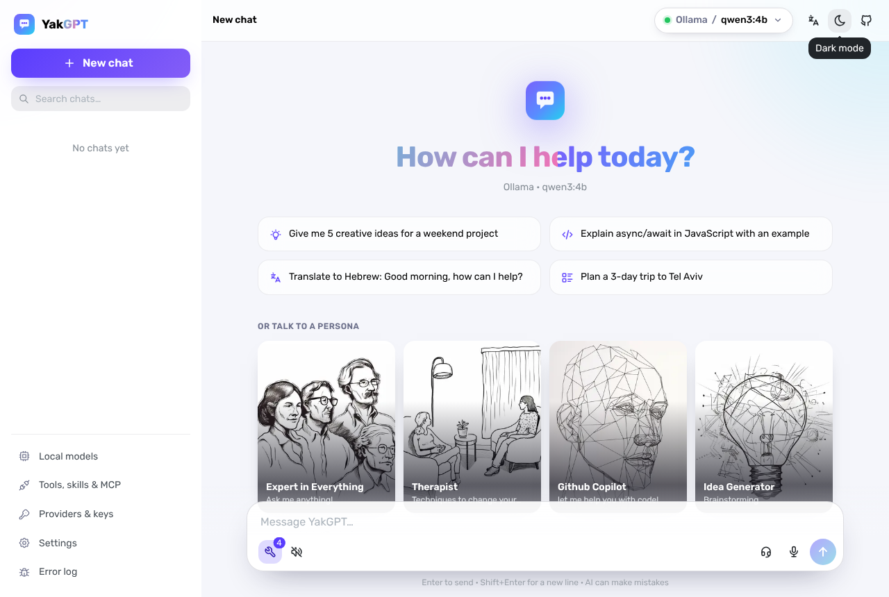
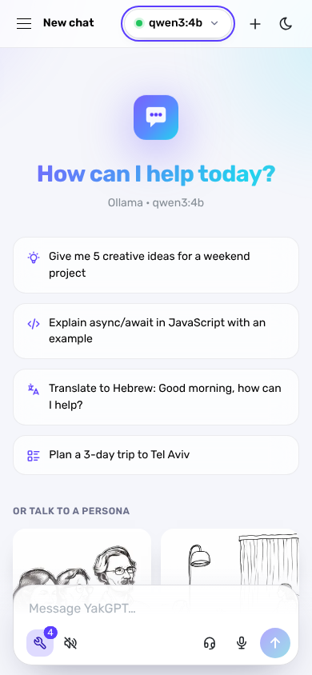

# YakGPT

A fast, private chat UI for every AI provider, local or in the cloud. Hebrew (right-to-left) and English interface.

## Features

- **Every major provider**: OpenAI, xAI (Grok), Groq, OpenRouter, Google Gemini, and local models through Ollama. Switch provider and model from the picker at the top.
- **Local models that fit your machine**: on first launch YakGPT detects your CPU, RAM and GPU, suggests Ollama models that will run well, and downloads them with live progress.
- **Tools**: models can call tools (current time, calculator, fetch a web page) and you see every call and result.
- **MCP servers**: connect remote (HTTP) and local (stdio) Model Context Protocol servers, or import a Claude Desktop / Cursor `mcp.json`.
- **Skills**: instruction packs the model loads on demand (`SKILL.md` or JSON import/export).
- **Voice**: dictation (Whisper or Azure), read-aloud (OpenAI, Azure, ElevenLabs), and realtime speech-to-speech with Grok.
- **Images (vision)**: attach, paste or drop images and ask vision models about them.
- **Reasoning view**: thinking from reasoning models is shown in a collapsible block.
- **Error monitoring**: in-app error log with JSON export, error boundaries, optional Sentry.
- **Modern UI**: Next.js 16, React 19 and Mantine 9, light/dark themes, smooth animations, mobile friendly.
- **Private**: keys and chats are stored in your browser and sent only to the provider you chose.

## Screenshots

| Chat (Hebrew, dark) | Setup wizard with hardware detection |
| --- | --- |
|  |  |
| **Tools, MCP and skills** | **English, light** |
|  |  |



## 🚀 Getting Started

Visit [YakGPT](https://yakgpt.vercel.app) to try it out without installing, or follow these steps to run it locally:

### Prerequisites

- [Node.js](https://nodejs.org/) 20.9 or newer
- [Yarn](https://yarnpkg.com/) (or npm or pnpm)
- Optional: [Ollama](https://ollama.com) for local models

### Installation

The install scripts check Node.js (20.9+), install dependencies, build, and create a `yakgpt` launcher. The app listens on `127.0.0.1:3000` only, so it isn't reachable from your network unless you pass `--host 0.0.0.0`.

**Linux / macOS**

```
$ git clone https://github.com/analist0/yakGPT.git && cd yakGPT
$ ./scripts/install.sh            # add --ollama to also install Ollama
$ yakgpt --open
```

**Windows** (PowerShell)

```
> git clone https://github.com/analist0/yakGPT.git; cd yakGPT
> powershell -ExecutionPolicy Bypass -File scripts\install.ps1   # add -Ollama to also install Ollama
```

Then double-click `yakgpt.cmd`. If Node.js is missing, the script installs it with `winget`.

**Android (Termux)**

Install [Termux](https://f-droid.org/packages/com.termux/) from F-Droid (the Play Store build is outdated), then:

```
$ pkg install -y git
$ git clone https://github.com/analist0/yakGPT.git && cd yakGPT
$ ./scripts/install.sh --ollama --boot
$ yakgpt --open
```

- **Building:** the script installs Node.js with `pkg` and builds with webpack, since Next.js has no native compiler for Android.
- **Add to Home screen:** in the browser, add YakGPT to the home screen and it opens as a standalone app.
- **Start at boot:** `--boot` starts YakGPT when the phone boots. It needs the [Termux:Boot](https://f-droid.org/packages/com.termux.boot/) app.
- **Keep it running:** run `termux-wake-lock`, otherwise Android may stop the server in the background.
- **Local models:** on a phone, small models (1–4B parameters) are the realistic choice.

**Manual**

```
$ yarn && yarn build && yarn start    # yarn start = node scripts/start.mjs [--port 3000] [--host 127.0.0.1] [--open]
```

On Termux, build with `yarn build:webpack`.

## 🔑 Providers and keys

The setup wizard asks for keys on first launch; you can change them any time under **Providers & keys**. Keys can also be set in `.env.local` (⚠️ local use only, they end up in the browser bundle):

```
NEXT_PUBLIC_OPENAI_API_KEY=...
NEXT_PUBLIC_XAI_API_KEY=...
NEXT_PUBLIC_GROQ_API_KEY=...
NEXT_PUBLIC_OPENROUTER_API_KEY=...
NEXT_PUBLIC_GEMINI_API_KEY=...
NEXT_PUBLIC_OLLAMA_BASE_URL=http://localhost:11434/v1
NEXT_PUBLIC_CHAT_PROVIDER=openai   # openai | xai | groq | openrouter | gemini | ollama
NEXT_PUBLIC_11LABS_API_KEY=...
NEXT_PUBLIC_AZURE_API_KEY=...
NEXT_PUBLIC_AZURE_REGION=...
NEXT_PUBLIC_SENTRY_DSN=...          # optional error reporting
```

Speech to text (Whisper) and OpenAI text to speech use the OpenAI key.

### Local models (Ollama)

Install [Ollama](https://ollama.com) and start it so the app's origin may call it:

```
$ OLLAMA_ORIGINS=http://localhost:3000 ollama serve
```

YakGPT finds it automatically. Open **Local models** to see your hardware, the models that fit, and to download or remove models.

### Realtime voice (Grok)

With an xAI key set, the headset button in the composer starts a speech-to-speech conversation with Grok. Both sides are transcribed into the chat, and the chat's system prompt and recent messages are given to the voice model. When tools are on, Grok can call the same built-in tools, MCP tools and skills as the text chat; the calls appear in the chat as tool cards. Voice and model are under **Settings → Voice**.

### Images

Attach up to 8 images per message with the image button, by pasting (Ctrl+V) or by dropping them on the message box. They are scaled down to 1568 px and sent in the OpenAI image format, which OpenAI, Gemini, xAI, OpenRouter and vision models on Ollama (for example `gemma3`, `qwen2.5vl`) accept. Pick a vision model: others reject the request. Images are stored in the browser's IndexedDB, not in localStorage.

### Tools, skills and MCP

Open **Tools, skills & MCP**:

- **Tools**: turn tool use on or off, globally or per tool. Models that don't support tools answer normally.
- **Approval**: choose when the model must ask before running a tool:
  - **Normal** (default): only tools that read run on their own.
  - **Medium**: reads and reversible changes run on their own; deleting, sending, paying or publishing asks.
  - **Free driving**: nothing asks.

  A per-tool "Always ask" / "Never ask" overrides the mode. MCP tools are classified with the server's MCP annotations; tools without them count as destructive.
- **MCP servers**: add a remote server by URL, or a local server by command (for example `npx -y @modelcontextprotocol/server-filesystem ~/Documents`). Quick-add presets and `mcp.json` import are included.
- **Skills**: write instruction packs with a name and a "when to use" description; the model loads one with the `load_skill` tool when a task matches. **Import from GitHub** takes a public repository (for example `anthropics/skills`), a folder in it, or a single `SKILL.md` link, lists every skill it finds and imports the ones you pick. Importing again updates skills with the same name.

### Local-only server features

Local MCP servers, hardware detection and the `fetch_url` tool run on the server, so they only answer requests from the same machine (loopback). To use them from elsewhere, for example through Docker's port mapping, set `YAKGPT_LOCAL_FEATURES=1`. Only do that when the port is not reachable by other people: it lets the browser start processes on the server.

## 🐳 Docker

To use the pre-built Docker image from Docker Hub (only for amd64), run:

```
$ docker run -it -p 3000:3000 yakgpt/yakgpt:latest
```

---

To build the Docker image yourself (such as if you're on arm64), run:

```
$ docker build -t yakgpt:latest .
$ docker run -it -p 127.0.0.1:3000:3000 -e YAKGPT_LOCAL_FEATURES=1 yakgpt:latest
```

`YAKGPT_LOCAL_FEATURES=1` enables local MCP servers and hardware detection inside the container (see above); binding to `127.0.0.1` keeps the port private to your machine. Hardware detection then reports the container's view of the machine.

## 🎤 Microphone Integration

YakGPT makes chatting a breeze with its microphone integration! Activate your microphone using your browser's permissions, and YakGPT will automatically convert your speech into text.

You can also toggle the mic integration as needed by clicking on the microphone icon in the app.

Remember to use a supported web browser and ensure your microphone is functioning properly.

## 🛡️ Data Privacy and Security

YakGPT uses your own API keys. Chats and keys are stored in your browser, and requests go directly from your browser to the provider you chose. The YakGPT server is only involved for local MCP servers, hardware detection and the `fetch_url` tool.

## 👩‍💻 For developers

[docs/DEVELOPERS.md](docs/DEVELOPERS.md) (Hebrew) covers the code map, how a message flows through the agent loop, what is tested and what isn't, known gaps (images/video, tool approval, tests/CI) and the plan for each.

## 📝 Changelog

See [CHANGELOG.md](CHANGELOG.md) for what changed in each release (Hebrew and English).

## 📃 License

This project is licensed under the MIT License - see the [`LICENSE`](LICENSE) file for details

## 🙌 Acknowledgments

- [OpenAI](https://openai.com/) for building such amazing models and making them cheap as chips.
- [Mantine UI](https://ui.mantine.dev/) just an all-around amazing UI library.
- [opus-media-recorder](https://github.com/kbumsik/opus-media-recorder) A real requirement for me was to be able to walk-and-talk. OpenAI's Whisper API is unable to accept the audio generated by Safari, and so I went back to wav recording which due to lack of compression makes things incredibly slow on mobile networks. `opus-media-recorder` saved my butt by allowing cross-platform compressed audio recording via web worker magic. 🤗

Got feedback, questions or ideas? Feel free to submit an issue!
